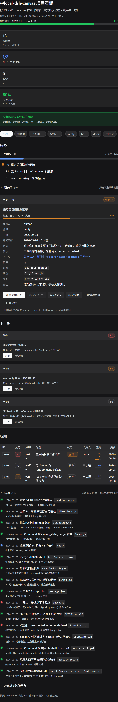
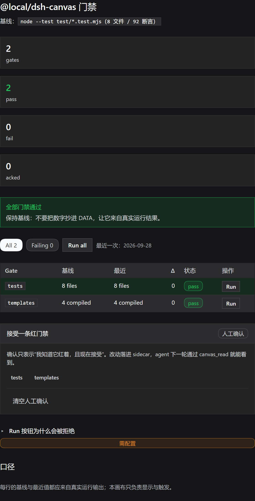
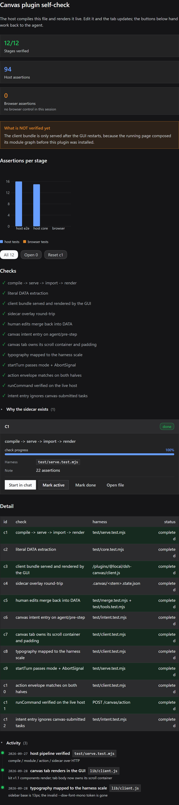
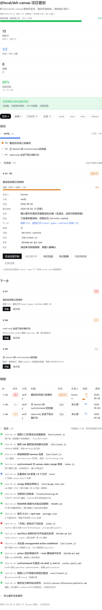
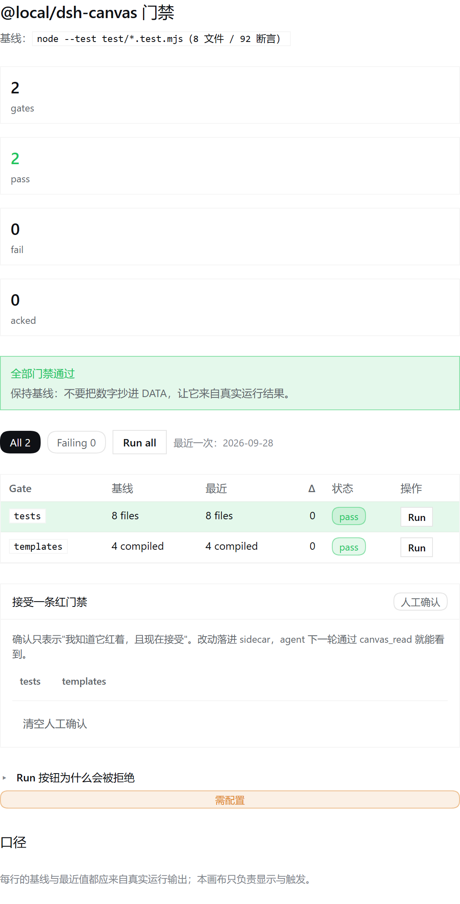
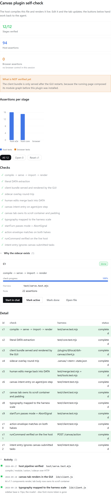

# @local/dsh-canvas —— DeepSeek Harness 的项目看板插件

> **一个适配 DeepSeek Harness 的项目看板插件。** agent 把项目的审计结论与工程现状写成 `.canvas.tsx`，宿主（host 半边）实时编译并渲染到右栏，面板上的决定可以回流给 agent。

- **插件形态**：DeepSeek Harness 的工作区 bundle，单包双半 —— host（Node / cordis）+ 浏览器半边（零依赖，只 `require("react")`）。
- **看板形态**：任务跟踪 / 门禁对齐 / 迁移进度 / 方案对比。行的单位是「条目」，每条带状态、进度、日期、阻塞、下一步、验收与证据；进度、风险、「下一步」全部从 `DATA` 现算。
- **harness 原生**：意图入口挂在 `agent/pre-step`；门禁执行走 `ctx.shell` 并按调用 Session 的 `ctx.sandboxPolicy` 约束；画布的「在会话里开始」走 `sessionController`；颜色与排版取自 harness 的 token，明暗主题自动跟随。
- **对 agent 省 context**：`canvas_read` 只取切片（`dataPath` / `filter` / `ids` / `limit`），`canvas_state_merge` 把人的改动最小化写回源文件。
- **可验收**：`npm test` → 8 个文件 / 94 断言；模板语料永远可编译。

## 是什么

把"给人看的产物"从散文 markdown 变成**能编译的可交互面板**：agent 写一个 `*.canvas.tsx` 文件，host 用 sucrase 编译成 ESM，浏览器动态 import 后渲染成右栏 tab；面板上的按钮能打开文件、发起新回合、跑白名单命令。

它解决的不是"好不好看"，而是三件事：

1. 多状态长任务有一个**可下钻的常驻面板**，而不是每轮重贴 markdown；
2. 面板数据**结构化可查询**（`canvas_read` 取切片），agent 的 context 成本与文件总大小脱钩；
3. 门禁的红绿来自 **harness 真实退出码**，不是模型的自述。

**不是什么**：(a) 不是 `todo_write` 的替代（短任务仍用它）；(b) 不是 `goal` 的替代（goal 管"要不要继续下一轮"）；(c) 不是通用前端框架——画布只能 import `"dsh/canvas"`；(d) 不是第三方内容的沙箱（画布代码 = 插件信任级别，见"已知限制"）。

## 效果

下面三张是**真实渲染**：用 `host/compile.js` 编译真实画布，交给 `lib/client.js` 的套件渲染成 HTML，再套 harness 的主题 token 截图——不是示意图，也不是手画的 mock。生成脚本：[docs/preview/render.mjs](docs/preview/render.mjs)（`PREVIEW_WIDTH=560 THEME=dark node docs/preview/render.mjs board.canvas.tsx gates.canvas.tsx examples/selfcheck.canvas.tsx`；去掉 `THEME=dark` 即浅色）。

**项目看板**（[board.canvas.tsx](board.canvas.tsx)）：概览指标、派生风险、按 lane 分组的待办、富字段详情、下一步、明细表与活动时间线——每个数字都从 `export const DATA` 现算，没有手抄结论。

**门禁看板**（[gates.canvas.tsx](gates.canvas.tsx)）：每行一个 Run 按钮，执行走真实 `ctx.shell`（白名单 + 调用方 Session 的沙箱策略），面板拿到的是真实退出码；基线/最近两列让人一眼看出是否回落。

**套件全貌**（[selfcheck.canvas.tsx](examples/selfcheck.canvas.tsx)）：`Stack / Row / Stat / Progress / BarChart / Table / Timeline / TodoList / CollapsibleSection / Button / Pill` 与全部钩子在同一张画布上（画布一律单列纵向）。

> 截图宽度 560px、2x 缩放（贴近右栏实际宽度），画布**单列纵向**排列，所以图比较长。主题为 harness **深色**：light / dark 两套 token 在同一条主题表里，靠 `body[data-ds-dark-theme]` 切换 —— 脚本用 `THEME=dark` 生成深色，去掉即浅色。

浅色主题变体（同样三张）

## 画布意图入口（host hook）

用户说"建个项目的 canvas / 看板 / 画布 / 画板 / 项目文档 / dashboard"时，**不是**在要一篇文档，而是在要"把审计结论与工程现状结构化、可下钻、可回写地呈现"。host 半边在 `agent/pre-step` 上注册了一个意图入口：

- **命中信号**：强名词 `看板 / 画布 / 画板 / 仪表盘 / dashboard / kanban` 直接命中；弱名词 `canvas / board / 项目文档 / 工程现状 / 审计报告 …` 需搭配创建动词（`建 / 做 / 生成 / create / make …`）；
- **动作**：在进入步骤的消息批次末尾追加一条带来源（`dsh-canvas`）的 user 消息，内容是 **intake 指引**——先说清 intent，再把 7 个对齐问题摆给用户，最后是产出顺序与质量门槛；完整契约见 [skills/canvas/references/intake.md](skills/canvas/references/intake.md)；
- **边界**：只匹配**人**说的内容（`source.kind === "user"`），不会被别的插件注入的上下文再次触发；每轮只注入一次（后续 step 的消息批次为空）；它自己的异常一律放行，不会破坏 step。

原因：画布的质量几乎完全由"写之前有没有对齐口径"决定。没有入口时，agent 倾向于直接产出一个只有标题与状态的薄看板。

开关与定制：`intentHook: false` 关闭；`intentKeywords` 追加部署自己的触发词；`intentGuide` 替换指引正文。

## 装法

以普通工作区 bundle 安装：

1. 把本目录（含 `package.json` / `cordis.patch.yml` / `index.js` / `host/` / `client/` / `lib/`）放在工作区任意位置；
2. 用 `plugin_manager` 的 `install_bundle`，`target` 传**本目录绝对路径**；由它完成依赖安装（`sucrase`）与 bundle 选择。不要手改 `$DSH_HOME` 下的 profile 文件，也不要在 profile 目录里跑 pnpm；
3. 读安装结果：只有 `application: applied` 说明改动生效。`restart-required` 表示需要重启，`overridden` 表示被更高优先级的 patch 层覆盖；
4. 之后可用 `list_plugins` / `set_plugin` 开关该行。替换已安装包需要重启才能加载新的 JS 模块代。

配置覆盖写在**你自己 profile 的 `cordis.patch.yml`**（用户 patch 层在 bundle 层之后应用）：

~~~yaml
- id: dsh-canvas
  name: "@local/dsh-canvas"
  config:
    maxSourceBytes: 2097152
    commandWhitelist:
      - id: gate:phase19
        title: phase19 gate
        command: cargo test -p occt-topo phase19
        timeoutMs: 600000
~~~

## 配置项

随包发出的 `cordis.patch.yml` 默认值如下。

| 键 | 默认 | 含义 |
|---|---|---|
| `maxSourceBytes` | `1048576`（1 MB） | 源码字节硬上限，超出报 `E_TOO_LARGE` |
| `maxLines` | `8000` | 源码行数硬上限 |
| `maxDataBytes` | `4194304`（4 MB） | 抽取后 `DATA` 的 JSON 字节硬上限 |
| `maxRenderRows` | `5000` | 单次渲染行数硬上限；超出截断并显示 `showing N of M`（渲染期文案，不是编译诊断） |
| `compileTimeoutMs` | `2000` | 单文件编译超时，超出拒绝编译 |
| `commandWhitelist` | `[]` | `runCommand` 白名单，**默认空 = 全部拒绝**；每项 `{ id, title, command, cwd?, timeoutMs? }` |
| `startTurnCooldownMs` | `30000` | 同一画布 + 同一 prompt 的冷却窗口（去重） |
| `intentHook` | `true` | 是否注册画布意图入口（`agent/pre-step`）：命中时把 intake 指引注入当前步骤 |
| `intentKeywords` | `[]` | 额外的**弱**名词，需搭配创建动词才触发；例如 `["风险登记册"]` |
| `intentGuide` | — | 用自定义指引替换内建 intake 正文（命中信号行仍会附在末尾） |

补充：

- 软阈值（源码 128 KB / 1500 行 / `DATA` 512 KB / 单组件 300 行）目前是**内建常量**，不在 Config 里，只产生 `W_LARGE_FILE` 警告；行数截断是渲染期文案，不是诊断。若要可配置，请先改 `INTERFACE.md` 再实现（配置面属于冻结接口）。
- 白名单项必须**逐字匹配**画布请求（按 `id` 或完整 `command` 字符串）；命令字符串永远取自白名单项，执行经 `ctx.shell` 并按调用 Session 的 `ctx.sandboxPolicy` 约束。白名单为空返回 `{ ok: false, code: "unsupported" }`，未登记返回 `denied`。

## 架构（两半）

单包双半：`package.json` 同时声明 `dsh.bundle.patch`（host 行）与 `dsh.client`（浏览器半边）。

| 半边 | 入口 | 职责 |
|---|---|---|
| host (Node) | `index.js` + `host/` | 编译（sucrase）、内容寻址模块服务、画布发现与 watch、`DATA` 抽取、sidecar overlay 读写、动作桥、四个模型工具 |
| browser | `client/` 源码 → 构建产物 `lib/client.js` | `dsh/canvas` 套件、`sidebar.right` tab type（认领 `*.canvas.tsx`）、源码读取、动态 `import()` 挂载、错误边界 |

客户端模块注册 id **必须等于包名** `@local/dsh-canvas`；浏览器半边**只允许** `require("react")`，不得 require 任何 DSH client 包。

关键链路：

1. **编译**：`POST /canvas/compile { path, source }` 返回 `{ ok, sha, url, diagnostics }`；**编译失败不是 HTTP 错误**，永远 200。
2. **取模块**：`GET /canvas/module/<pathHash>/<sha>.js` 内容寻址、`immutable`。源码 / 编译器版本 / 套件版本任一变化即新 URL，因此未变化的保存不触发重编译。
3. **注入**：动态 import 之前**同步**设置 `globalThis.__DSH_CANVAS__`（`h`、`Fragment`、`React` + 平铺的套件导出）。
4. **动作分流**：`openFile` / `openResource` / `copy` 由 client 自己处理；`startTurn` / `runCommand` / `notify` / `overlaySet` / `overlayClear` 发往 `POST /canvas/action`。
5. **sidecar**：人的改动落在与被引用画布同目录的 `.canvas/<stem>.state.json`；`canvas_read` 能读到，`canvas_state_merge` 可合并回源文件。

完整 HTTP 面与 `CanvasDiagnostic` 形状见 [INTERFACE.md](INTERFACE.md)。

## 画布文件约定

三条硬规则 + 一个推荐：

~~~tsx
/** @canvas
 * title: My board
 * description: 一句话说明
 * icon: board
 */
import { H1, Text, Stack } from "dsh/canvas";

export const DATA = { items: [{ id: "a", title: "first" }] } as const;

export default function MyBoard() {
  return (
    <Stack gap={16}>
      <H1>My board</H1>
      <Text tone="secondary">DATA has {DATA.items.length} item(s).</Text>
    </Stack>
  );
}
~~~

1. 必须有 `export default`（无参组件）；
2. 只能 import `"dsh/canvas"`（其它说明符一律 `E_PARSE_IMPORT`）；
3. 纯渲染：禁止 `fetch` / `setTimeout` / `document` / `window` / `eval` / `iframe` / 远程资源；
4. **推荐** `export const DATA = { ... } as const`，且 `DATA` 必须是**纯字面量**（无函数调用、无模板拼接、无非字面量 spread、无 `Date.now()`）——host 用括号扫描把它抽出来，**不执行代码**；这样 `canvas_read` 才能按 `dataPath` / `filter` / `ids` 切片。

状态放哪：

- **要 agent 看见的**（人的标记、认领、豁免）→ `useCanvasOverlay`（落 sidecar，`canvas_read` 可读）；
- **纯 UI 态**（筛选器、当前选中项）→ `useCanvasState`（localStorage，**agent 看不到**）。

## 模型工具

| 工具 | 用途 |
|---|---|
| `canvas_new` | 按 `kind: "blank" \| "board" \| "gates"` 生成脚手架（与 `skills/canvas/templates/` 同源） |
| `canvas_check` | 静态扫描 + sucrase 编译 + `DATA` 抽取，返回 `CanvasDiagnostic[]`；**不渲染** |
| `canvas_read` | 抽取 `DATA` + 合并 sidecar + 切片 / 过滤 / 截断，返回结构化 JSON 与统计；`W_NO_DATA` 时退化为源码文本 |
| `canvas_state_merge` | 把 sidecar 补丁最小化写回源文件 `DATA`，并从 sidecar 移除 |

**不要全文重读画布**：用 `canvas_read` 取切片，改完用 `canvas_check` 自检——这是本插件对 context 成本的核心承诺。

## 技能与模板

- [skills/canvas/SKILL.md](skills/canvas/SKILL.md) —— 何时写画布、四步流程、保持小的纪律、反模式；
- [skills/canvas/references/kit.md](skills/canvas/references/kit.md) —— 套件完整 API（组件 + 钩子 + 类型）；
- [skills/canvas/references/patterns.md](skills/canvas/references/patterns.md) —— 看板 / 门禁 / 时间线 / 对比四类范式；
- [skills/canvas/references/troubleshooting.md](skills/canvas/references/troubleshooting.md) —— 诊断码逐条修法；
- [skills/canvas/references/intake.md](skills/canvas/references/intake.md) —— 画布意图入口的 intake 契约（审计 / 工程分析 → 高质量画布）；
- `skills/canvas/templates/*.canvas.tsx` —— `canvas_new` 的三个模板，同时是**必须永远能编译**的回归语料。

## 验证方式

安装成功不等于用户看得见。按顺序真实操作：

1. `install_bundle` 返回 `application: applied`；`cordis_inspect_query` 能看到 `dsh-canvas` 行与四个工具。
2. 在工作区建一个最小画布（或 `canvas_new`），从文件树点开 → 右栏出现画布 tab 并渲染。
3. 改文件并保存 → 面板**不刷新页面**即更新。
4. 故意写错语法 → 出错误卡（带 `code` 与行列号）；改回 → 自动恢复。
5. `canvas_check` 跑 `skills/canvas/templates/` 三个模板 → 期望 0 error（回归语料）。
6. 明暗主题各看一次；控制台无 `slot entry crashed`。
7. 人点一次 overlay 按钮 → 关闭页面重开仍在，且 `canvas_read` 能读到该改动。

**当前未验证项**：真实 GUI 里的目视验收（三张画布的渲染、滚动与排版）；真实 `ctx.shell` 上的 `runCommand`；read-only 会话下的沙箱行为。

> P0 的两个实现期阻塞项（动态 `import()` 的 CSP、`sucrase` 装进 profile）已由运行中的 GUI 闭环：host 半边注入 intent 指引、client 半边渲染画布 tab 都已是实测事实。

## 已知限制

1. **信任级别 = 插件**：画布代码在宿主页面里执行。不注入 `fetch` / `localStorage` / `document`，也不允许远程资源，但**能**在浏览器里做任意计算（死循环 / 吃内存只能靠渲染上限与页面可恢复性缓解）。不引入 iframe / Worker 隔离。
2. **不真正虚拟化**：`Table` / `TodoList` 超过单组件 `maxRows`（默认 300）只截断并显示 `showing N of M`；`BarChart` 超过 40 个 category 只渲染前 40。
3. **诊断有两个产出方**：编译期（host 扫描 / 编译器 / 抽取 / `canvas_state_merge`）与渲染期（client 的截断文案）。`canvas_check` 只看得到前者，别用它验证行数上限。
4. **诊断码口径已收敛**（DESIGN §21）：`E_REACT_IMPORT` 已删除（`import React` 归 `E_PARSE_IMPORT`）；`W_UNKNOWN_PROP` / `W_DEPRECATED` / `W_NO_METADATA` 是 reserved，当前不产出；`W_MANY_ROWS` 是渲染期文案。逐条见 troubleshooting.md。
5. **旧模块不回收**：浏览器无法卸载已 import 的 ESM，长期会话里旧版本模块会累积（数量 = 修订数），只能提示重载页面。
6. **只能 import `dsh/canvas`**：画布之间不能互相 import，也不能用第三方库；`BarChart` 只有分组柱状图。
7. **`runCommand` 只跑白名单**：命令字符串**永远取自** Config 的 `commandWhitelist` 项（请求只能按 `id` 或完整命令选中，不能改写它），执行经 `ctx.shell` 并按调用 Session 的 `ctx.sandboxPolicy` 约束。白名单为空返回 `unsupported`，未登记返回 `denied`。
8. **`startTurn` 有限流**：同一画布 + 同一 prompt 在 `startTurnCooldownMs` 内只接受一次，防止误点或循环刷会话。
9. **发现范围是工作区**：工作区外的 `*.canvas.tsx` 可以用文件地址打开，但不会出现在画布目录里。
10. **单包双半**：host 半边依赖 `sucrase`，浏览器半边必须零依赖；二者一起发布，不能只装一半。
11. **sidecar 可能陈旧**：源文件变化后 overlay 不自动丢弃，会以 `staleOverlay` / `orphan` 暴露给 `canvas_read`，由 agent 决定是否 `canvas_state_merge`。
12. **`.canvas/` 目录名**尚未与既有习惯（`.target-gate/`、`.codegraph/`、`.cursor/`）统一评审。
13. **意图入口是启发式**：`agent/pre-step` 的匹配规则是强 / 弱名词 + 创建动词，误判与漏判都会发生；用 `intentHook` / `intentKeywords` / `intentGuide` 调，不要指望 100% 准。

## 相关文档

- 设计文档：[../../specs/_design_canvas_plugin.md](../../specs/_design_canvas_plugin.md) —— 决策记录、套件 API、分阶段计划、风险登记册
- 冻结接口：[INTERFACE.md](INTERFACE.md) —— host↔client 唯一契约
- 包清单：[package.json](package.json)
